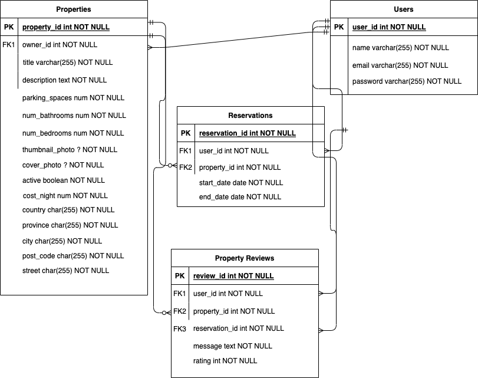

# lighthouseBnB

## Dependencies
- node.js
- dotenv
- nodemon
- sass
- bcrypt ^5.1.0,
- body-parser ^1.19.0,
- cookie-session ^1.3.3,
- express ^4.17.1,
- nodemon ^2.0.20,
- pg ^8.8.0 

## Getting Started

- Install all dependencies (using the `npm install` command).
- Run the development web server using the `npm run local` command.

## Database and ERD


- Setup and connect to `lightbnb` database using [.env.example](/.env.example) 
- Run schema in [/database/migrations](/database//migrations/)
- Seed the database via [/database//seeds](/database//seeds/)

### Queries
Can be found in [/database//1_queries](/database//1_queries/)

## Project Structure

```
├── public
│   ├── index.html
│   ├── javascript
│   │   ├── components 
│   │   │   ├── header.js
│   │   │   ├── login_form.js
│   │   │   ├── new_property_form.js
│   │   │   ├── property_listing.js
│   │   │   ├── property_listings.js
│   │   │   ├── search_form.js
│   │   │   └── signup_form.js
│   │   ├── index.js
│   │   ├── libraries
│   │   ├── network.js
│   │   └── views_manager.js
│   └── styles
├── sass
└── server
    ├── database
    │   ├── connect.js
    │   ├── properties.js
    │   ├── reservations.js
    │   └── user.js
    ├── apiRoutes.js
    ├── server.js
    └── userRoutes.js
```

* `public` contains all of the HTML, CSS, and client side JavaScript. 
  * `index.html` is the entry point to the application. It's the only html page because this is a single page application.
  * `javascript` contains all of the client side javascript files.
    * `index.js` starts up the application by rendering the listings.
    * `network.js` manages all ajax requests to the server.
    * `views_manager.js` manages which components appear on screen.
    * `components` contains all of the individual html components. They are all created using jQuery.
* `sass` contains all of the sass files. 
* `server` contains all of the server side and database code.
  * `server.js` is the entry point to the application. This connects the routes to the database.
  * `apiRoutes.js` and `userRoutes.js` are responsible for any HTTP requests to `/users/something` or `/api/something`. 
  * `database/` is responsible for all queries to the database.